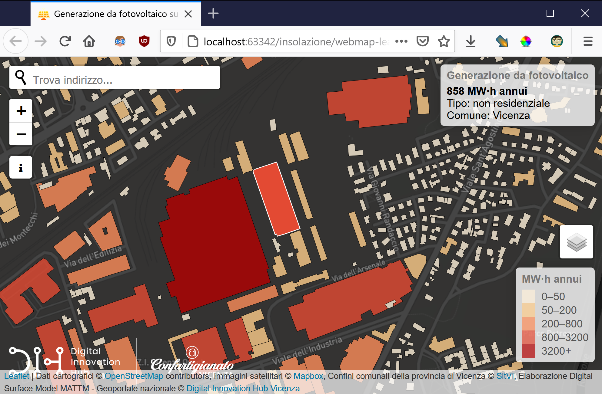
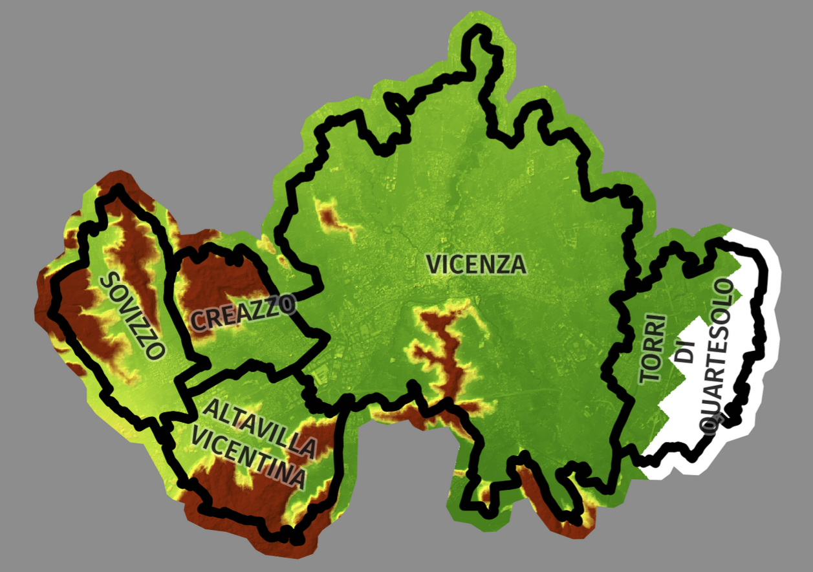

# Generazione di elettricità da fotovoltaico su tetti di Vicenza e i comuni contermini

La radiazione solare entrante (insolazione) ricevuta dal sole è la principale fonte di energia che guida molti dei processi fisici e biologici della terra. Questa mappa interattiva dimostra quanta energia elettrica può essere prodotta dagli edifici a **Vicenza**, **Altavilla Vicentina**, **Creazzo**, **Sovizzo** e **Torri di Quartesolo (VI)** in un anno, se i pannelli solari sono installati su loro tetti. [Link alla Web App](https://dih-map-insolazione-vi.s3.eu-south-1.amazonaws.com/map.html)

> Il progetto è parte del Operativo Regionale del Fondo Europeo di Sviluppo Regionale (POR FESR 2014 - 2020) del Veneto, nell'ambito del bando dell'azione 231 volto alla "costituzione di Innovation Lab diretti al consolidamento/sviluppo del network Centri P3@-Palestre Digitali e alla diffusione della cultura degli Open Data."


La Web App è basata sulla stima della quantità totale d'insolazione entrante (diretta e diffusa) calcolata per ogni punto del modello di superficie digitale (DSM) ad alta risoluzione.DSM rappresenta la topografia che è un fattore importante che determina la variabilità spaziale dell'insolazione. La variazione di elevazione, orientamento (pendenza e aspetto) e ombre proiettate da elementi topografici influiscono sulla quantità d'insolazione ricevuta in luoghi diversi. Questa variabilità cambia anche con l'ora del giorno e il periodo dell'anno e a sua volta contribuisce alla variabilità del microclima inclusi fattori come i regimi di temperatura dell'aria e del suolo, l'evapotraspirazione, i modelli di scioglimento della neve, l'umidità del suolo e la luce disponibile per la fotosintesi.



## Indice

1. [Struttura del repositorio](#struttura-del-repositorio)
2. [Informazioni sulla stima dell'insolazione](#informazioni-sulla-stima-dell'insolazione)
3. [Installazione](#installazione)
4. [Esempi](#esempi)
5. [Problemi conosciuti](#problemi-conosciuti)
6. [Credits](#credits)
7. [Licenza](#licenza)

## Struttura del repositorio

 Visto che la mappa dipende dalle informazioni sugli edifici, che è dinamica, il repositorio prevede anche lo script di aggiornamento.


    - data  # contiene i dati raster e vettoriali usati nell'aggiornamento della web app
      - download
      - output
    - docs  # immagini e altri file usati in questo README
    - processing  # lo script per aggiornare la web app
      - dependencies
      - log
    - webmap  # questa cartella contiene la web app

## Installazione

### Python

Abbiamo usato Windows per questo sviluppo, quindi l'istruzione è valida per questo sistema. Però dovrebbe funzionare anche su Linux e Mac.

Il repositorio consiste da due distinte parti. La prima è la web app (HTML, CSS e JS). La seconda è lo script in Python per aggiornarla. Abbiamo testato questo con Python 3.9.2, ma le versioni non inferiori a 3.6 dovrebbero funzionare.

1. Prima di tutto installa **Microsoft Visual C++** 14.0 (o maggiore). Scaricalo con lo strumento ["Microsoft C++ Build Tools"](https://visualstudio.microsoft.com/visual-cpp-build-tools/). 
   
2. Bisogna installare le seguenti librerie in ordine. Puoi usare la cartella ` processing/depenencies` che contiene i file necessari (Python Wheels) compatibili con la versione specifica del Python e architettura dell'OS: in questo caso è Windows x64, Python 3.7 o Python 3.8. Altrimenti scarica i Wheel dall'[Unofficial Windows Binaries for Python Extension Packages](https://www.lfd.uci.edu/~gohlke/pythonlibs/).

```
pip install processing\dependencies\GDAL-3.2.2-cp39-cp39-win_amd64.whl
pip install processing\dependencies\pyproj-3.0.1-cp39-cp39-win_amd64.whl
pip install processing\dependencies\Fiona-1.8.18-cp39-cp39-win_amd64.whl
pip install processing\dependencies\Shapely-1.7.1-cp39-cp39-win_amd64.whl
pip install processing\dependencies\geopandas-0.9.0-py3-none-any.whl
pip install processing\dependencies\Rtree-0.9.7-cp39-cp39-win_amd64.whl
pip install processing\dependencies\rasterio-1.2.1-cp39-cp39-win_amd64.whl
   
pip install requests rasterstats
```
L'ultima libreria viene installata dall'internet, dunque non specifichiamo nessun file.

### Aggiustamenti manuali

Dopo aver sistemato l'ambiente Python dobbiamo ancora preparare alcuni dataset.

1. Metti l'archivio `edifici_sitvi_7795.zip` con uno Shapefile di edifici, scaricati dal [SIT VI](http://sit.comune.vicenza.it/SitVI/SitVi_conf/download/index.php), nella cartella `data`. Per lo scarico dal SIT VI imposta i seguenti parametri:
   - gruppo `Cartografia di base`
   - file `Edifici`
   - formato `ESRI Shapefile`
   - Sistema di riferimento `RDN2008 - Zone12 (EPSG 7795)`
   - Nome file di output `edifici_sitvi_7795`
    
2. Assicurati che c'è anche l'archivio `data/comuni_provincia_vi_7795.zip` che contiene i limiti amministrativi della provincia.

3. Controlla le impostazioni nel `processing/config.py`: serve specificare i percorsi corretti nella sezione *RASTER* per appuntare a file `esposizione.tif`, `insolazione.tif`, `pendenza.tif`. Siccome ogni file è pesante (circa 1,3 GB) devi scaricarli separatamente da questa [cartella Google condivisa](https://drive.google.com/drive/folders/1_63OgU8CTWWDSU56AkYgrcsMiDs4O-FI?usp=sharing).

## Informazioni sulla stima dell'insolazione

### Insolazione

Per calcolare l'insolazione in un’intera area di Vicenza e i comuni limitrofi, abbiamo eseguito l'analisi utilizzando lo strumento **Area Solar Radiation (Radiazione solare di area) in software geoinformatico ArcGIS** sul modello della superficie DSM, derivato dalle riprese aeree Lidar. Cioè i calcoli sono stati ripetuti per ciascun pixel della superficie topografica d'input, producendo mappe d'insolazione per un'intera area geografica.

Sono stati impostati i parametri del calcolo:

- Dimensione Sky/Risoluzione: `200`
- Configurazione Temporale: WholeYear `2021`
- Intervallo Giornaliero: `14`
- Crea output per ogni intervallo: `NOINTERVAL`
- Fattore Z: `1`
- Tipo d'input pendenza e aspetto: `FROM_DEM`
- Direzioni di Calcolo: `16`
- Divisioni Zenith: `8`
- Divisioni Azimuth: `8`
- Tipo di modello Diffuso: `STANDARD_OVERCAST_SKY`
- Proporzione Diffusa: `0,3`
- Trasmissività: `0,5`

Lo strumento Area Solar Radiation è molto computazionalmente intenso. Per sollecitare il calcolo, I parametri **Direzioni di Calcolo** e **Intervallo Orale** sono stati diminuiti rispetto alle impostazioni predefinite. Inoltre, prima dell’elaborazione e per la migliore gestione del processo, l’intero dataset è stato suddiviso in parti più piccole (in totale 230 raster quadrati 1x1 km con la sovrapposizione di 10 pixel). L’intero tempo del calcolo è stato circa otto ore.
I parametri **Proporzione Diffusa (0,3)** e **Trasmissività (0,5)** sono predefiniti per condizioni di cielo generalmente sereno, che penso sia valido per Vicenza.

L’uscita dello strumento è un raster dell’insolazione, integrata per l’intero anno, che è espresso in **W\*h/m<sup>2</sup> (watt-ora per metro quadrato)** come unità di misura. Per ridurre le dimensioni di questi valori e renderli più facili da leggere, è stato convertito in **kW\*h/m<sup>2</sup>**.

### Caratteristiche del terreno

Per la seguente filtrazione è stato necessario di creare le mappe di pendenza (Slope) ed esposizione (Aspect) dal modello DSM, che abbiamo fatto con gli strumenti di analisi geomorfologica nel software QGIS.

## Esempi

### Web App

La mappa interattiva è fatta con ~~[OpenLayers](https://openlayers.org/)~~ [Leaflet](https://leafletjs.com/). Puoi semplicemente avviare `webmap/map.html` per vedere la mappa. Per renderla disponibile in internet bisogna copiare l'intera cartella `webmap` nel tuo web server. Non richiede nessun requisito speciale - è semplice HTML, CSS e JavaScript.

## Script dell'aggiornamento

Quando uno avvia lo script `processing/data_update.py` (è meglio lanciarlo con l'intefaccia Command Line del tuo OS - assicurati che utilizzi l'ambiente Python corretto con tutte librerie necessarie installate), esegue i seguenti passi:

1. Interroga il Geoportale Regionale per scaricare gli edifici](https://idt2.regione.veneto.it/geoportal/catalog/search/resource/details.page?uuid=r_veneto:edifici_veneto)sul territorio di Creazzo, Altavilla Vicentina, Sovizzo e Torri di Quartesolo. Il file scaricato viene salvato con un marcatempo unico come `processing/download/edifici_reg_20210325-174310.json`.
2. Fonde gli edifici dal SIT VI (comuni_provincia_vi_7795.zip) e il Geoportale regionale al fine di creare uno livello vettoriale uniforme, trasformando i loro attributi. Il risultato viene salvato come `processing/output/edifici_uniti.json`
3. Filtra il raster dell'insolazione sulla base di seguenti parametri che possano essere cambiati nel file `processing/config.py`. Abbiamo predefinito questi valori consigliati usando le informazioni dal sviluppatore di ArcGIS - [Estimate solar power potential](https://learn.arcgis.com/en/projects/estimate-solar-power-potential/). Sono rimasti solo le superficie con l'insolazione maggiore o uguale a 800 kW\*h/m<sup>2</sup> annui, privi dell'esposizione nord e nord-est, aventi la pendenza minore o uguale a 45°.
4. Calcolo delle statistiche è stato effettuato solo per edifici che hanno la superficie utilizzabile per la produzione dell'energia maggiore o uguale a 30 m<sup>2</sup>. Quindi altri edifici irrilevanti sono stati rimossi per ottimizzare la visualizzazione del dataset. È stata calcolata la quantità totale di radiazione solare ricevuta ogni anno dall'area utilizzabile di ciascun edificio. Per evitare che i numeri diventino troppo grandi, sono convertiti da **kilo**watt-ora per metro quadrato a **mega**watt-ora per metro quadrato. Dopo abbiamo convertito la radiazione solare in energia producibile, usando i valori del 15% di **efficienza del modulo fotovoltaico** e dell'86% del **Performance Efficiency**. Questi valori, consigliati dalla [United States Environmental Protection Agency](https://www.epa.gov/greenpower/green-power-equivalency-calculator-calculations-and-references), indicano che i pannelli solari sono in grado di convertire il 15 percento dell'energia solare in entrata in elettricità e l'86 percento di tale elettricità viene mantenuta nell'installazione. I parametri sono regolabili nel `processing/config.py`.

L'uscita di questa elaborazione viene salvato come `webmap/layers/edifici.js`. Quindi, la mappa web è stata aggiornata.

In caso se vuoi cambiare i parametri della elaborazione, basta riavviare lo script che sovrascriverà i file più vecchi.


## Problemi conosciuti

- A causa della copertura limitata del dataset originale DSM ricevuto dal MATTM, la parte orientale di Torri di Quartesolo non è coperta dall'analisi. Nello screenshot di sotto: il DSM usato per il calcolo, colorato secondo l'ipsometria (verde - quota bassa, marrone - quota alta, bianco - nessu dato disponibile):

- Su dispositivi mobili la mappa non risponde a touch - quindi no si può interrogare gli attributi degli edifici.
- La finestra "About" appare due volte quando chiamata su dispositivi mobili.

## Credits

Sviluppato nel [Digital Innovation Hub Vicenza](https://digitalinnovationhubvicenza.it/) con il supporto del comune di Vicenza e la Regione del Veneto.

## Licenza

### Web app e dati vettoriali dal comune e dalla regione


La IODL 2.0 (Italian Open Data License) prevede che l’utente possa liberamente:

- consultare, estrarre, scaricare, copiare, pubblicare, distribuire e trasmettere le informazioni;
- creare un lavoro derivato, per esempio attraverso la combinazione con altre informazioni (c.d. mashup), includendole in un prodotto o sviluppando un’applicazione informatica che le utilizzi come base dati.

In cambio, all’utente è chiesto solo d'indicare la fonte delle informazioni e il nome del soggetto che fornisce il dato, includendo, se possibile, un link alla licenza.
Rispetto alla IODL 1.0, la Italian Open Data Licence 2.0 non prevede l’obbligo dell’utente di pubblicare e condividere gli eventuali lavori derivati (ad esempio, applicazioni) con la stessa licenza o con altra licenza aperta, ritenuta compatibile. 

Vedi il file [LICENSE.md](LICENSE.md) per dettagli.

### Dati sull'insolazione e terreno
Questi file devi scaricare manualmente - vedi la sezione [Installazione - Aggiustamenti manuali](#aggiustamenti-manuali).

- `data/esposizione.tif`
- `data/insolazione.tif`
- `data/pendenza.tif`

Elaborazione di [Digital Innovation Hub Vicenza](https://digitalinnovationhubvicenza.it/) su dati del Ministero dell'Ambiente e della Tutela del Territorio e del Mare - [Geoportale nazionale (MATTM)](http://www.pcn.minambiente.it/mattm/). Questo dataset è distribuito con *Licenza Creative Commons Attribuzione - Condividi allo stesso modo 3.0 Italia*. Chiunque desideri riprodurre o pubblicare elaborati contenenti il dataset ha l'obbligo di rispettare i vincoli previsti dalla licenza.
